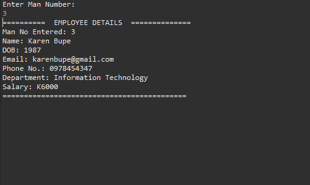

# Simple Client-Server App

Client Server Application a Java Networking Program that will perform the following tasks:  
i. use an ordered collection to store employees of five.   
ii. prompt user for a man number and request the server to retrieve the full record of that particular Employee.  

1. Starting the server

2. Starting the client side

3. Retrieve the full record of a particular Employee

